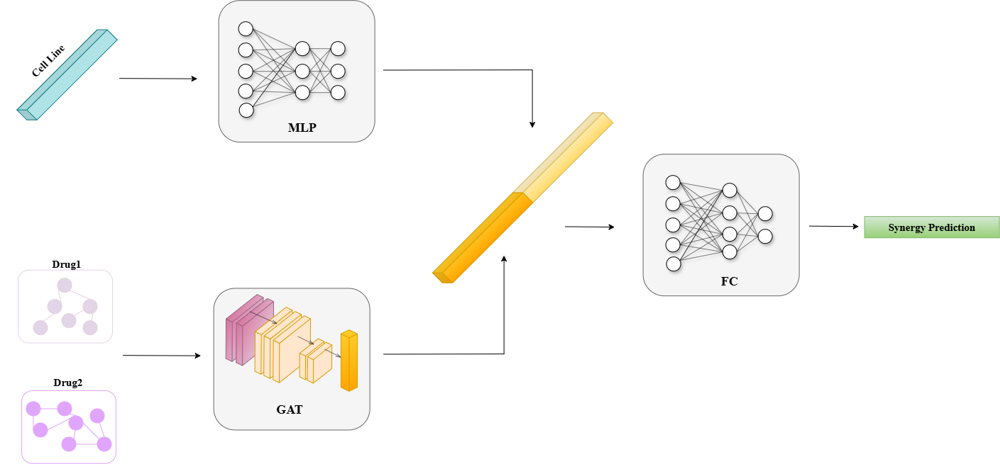
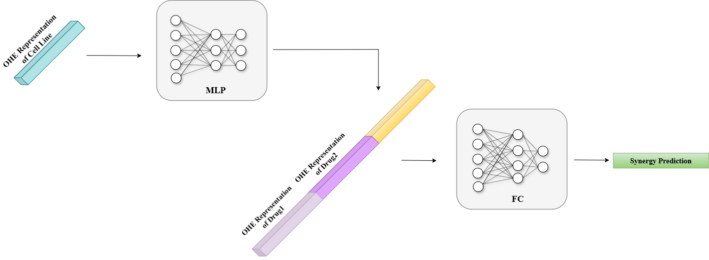

# DeepDDS: deep graph neural network with attention mechanism to predict synergistic drug combinations

**DeepDDS** uses a graph neural network to learn drug representations while cell line features are embedded using a multilayer perceptron. These embeddings are concatenated and input into a fully connected network to predict synergy classification.

- **Drug Features**: Molecular graphs, where atoms are nodes and bonds are edges.  
- **Cell Line Features**: Cell line gene expression profiles.

---

## DeepDDS Architecture

The architecture of the DeepDDS model is shown below:

  

*Figure 1: Architecture of DeepDDS, inspired by Wang et al. (2021)*

---

## Dataset and Splitting Information

DeepDDS was trained on the **O'Neil** dataset using **Leave-Triple-Out (LTO)** splits and 5-fold cross-validation. The dataset and hyperparameters were provided by the authors. Splits were randomly created once, and the same sets were used for consistency in the drug and cell line features experiment and in the one hot encoded experiment.

In one-hot encoded feature experiments, the molecular graph module and cell line MLP were excluded, as shown in **Figure 2**:

  

*Figure 2: Architecture of DeepDDS for training with one hot encoded features*

---

### O'Neil Dataset

#### Combination Dataset
- **`new_labels_0_10.csv`**:  Available under the `data/` folder. Contains drug pair and cell line combination information with synergy classification labels.

#### Drug & Cell Line Features
- **Drug Features**:
  - RDKit converts SMILES into molecular graphs, with nodes (atoms) and edges (bonds). DeepChem computes atomic features, including atom type, valence, and aromaticity as node features.

- **Cell Line Features**:
  - **new_cell_features_954.csv**: Gene expression profiles filtered to 954 genetic features.

 You can generate input files using creat_data_DC.py or you can download preprocessed data files: `new_labels_0_10_drug1.pt` from [here](https://huggingface.co/datasets/ebcandir/DeepDDS/resolve/main/new_labels_0_10_drug1.pt) and `new_labels_0_10_drug2.pt` from [here](https://huggingface.co/datasets/ebcandir/DeepDDS/resolve/main/new_labels_0_10_drug2.pt). 

#### One-Hot Encoded Features
- **Drug Features**:
- `new_labels_0_10_drug1_features_ohe.csv`: One-hot encoded representation for drug 1.

- `new_labels_0_10_drug2_features_ohe.csv`: One-hot encoded representation for drug 2.

- **Cell Line Features**:
- `new_labels_0_10_cell_features_ohe.csv`:  One-hot encoded representation for cell lines.

> Note: You can generate these three files using the provided `generate_ohe.py` script.

#### Shuffled Features
In this setting, the **Combination Dataset** SMILES strings are randomly reassigned so that each drug is assigned a different SMILES than its original one. This breaks the true drug–feature associations while preserving the overall feature distribution.

- **Shuffled Drug Features**: Molecular graphs are generated from the SMILES corresponding to the *newly assigned* drug indices in [`new_labels_0_10_deranged.csv`](https://huggingface.co/datasets/ebcandir/DeepDDS/resolve/main/new_labels_0_10_deranged.csv).  
- **Shuffled Cell Line Features**: Cell line features are also randomly reassigned, as provided in [`remapped_cell_features.csv`](https://huggingface.co/datasets/ebcandir/DeepDDS/resolve/main/remapped_cell_features.csv).

You can prepare the shuffled input files in two ways:  
1. **Generate from scratch** using the provided [creat_data_DC.py](https://huggingface.co/datasets/ebcandir/DeepDDS/resolve/main/creat_data_DC.py) script.  
2. **Use preprocessed files**:  
   - [`new_labels_0_10_deranged_drug1.pt`](https://huggingface.co/datasets/ebcandir/DeepDDS/resolve/main/new_labels_0_10_deranged_drug1.pt)  
   - [`new_labels_0_10_deranged_drug2.pt`](https://huggingface.co/datasets/ebcandir/DeepDDS/resolve/main/new_labels_0_10_deranged_drug2.pt)

---
### Training DeepDDS with Drug & Cell Line Features 

```bash
python training_GAT.py
```

You can run the shuffled setup using:  
```bash
python training_GAT.py \
  --combination_file new_labels_0_10_deranged.csv \
  --drug1_features new_labels_0_10_deranged_drug1.pt \
  --drug2_features new_labels_0_10_deranged_drug2.pt
```

### Training DeepDDS with One-Hot Encoded Features

```bash
python deepdds_training_without_graph.py
```


## Reproducing Experiments

For further details on the DeepSynergy framework or dataset preparation, visit the official DeepDDS [GitHub repository](https://github.com/Sinwang404/DeepDDs/tree/master)


Additionally, a hybrid experiment using one-hot encoded drug features and gene expression levels for cell lines was performed. For this setup:

- Use the same one-hot encoded files for drugs.
- Use `new_labels_0_10_cell_features.csv` for cell line gene expression.
- In `deepdds_training_without_graph.py`, and `models/deepdds_without_graph.py` uncomment the code section for cell line gene expression features("For using cell line features") and comment out the one-hot encoded section("For using cell line one hot encoded features").


> **Important Note:** Ensure you provide the correct paths to the input files and directories. 
