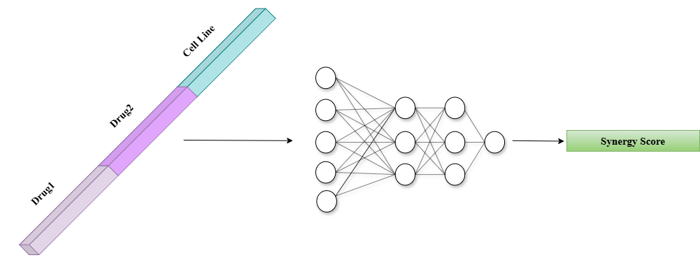

# DeepSynergy:  predicting anti-cancer drug synergy with Deep Learning

**DeepSynergy** is the one of the earliest deep neural network based approach used for predict **Loewe synergy score** for drug pair - cell line combinations.

- **Drug Features**: Chemical fingerprints.  
- **Cell Line Features**: Cell line gene expression profiles.

---

## DeepSynergy Architecture

The architecture of the DeepSynergy model is shown below:

  

*Figure 1: Architecture of DeepSynergy, inspired by Preuer et al. (2017)*

---

## Dataset and Splitting Information

DeepSynergy was trained on the **O'Neil** dataset using **Leave-Pair-Out (LPO)** splits and 5-fold nested cross-validation. The dataset, splits, and hyperparameters were provided by the authors.

---

### O'Neil Dataset

#### Combination Dataset
- **`labels.csv`**:  Available under the `DeepSynergy/` folder. Contains drug pair and cell line combination information with synergy scores.

#### Drug & Cell Line Features
- **Drug Features**:
  - Derived from SMILES, including:
    - **ECFP_6 fingerprints**: 1309 features.
    - **Physico-chemical properties**: 802 features.
    - **Binary toxicophore features**: 2276 features.


- **Cell Line Features**:
  - **Gene expression profiles**: 3984 genetic features.

> **Note:** You can download [`X.p.gz`](https://huggingface.co/datasets/ebcandir/DeepSynergy/resolve/main/X.p.gz) and use `normalize.py` to produce processed input files for training.

#### One-Hot Encoded Features
- `OHEData/ohe_data_test_foldX_val_foldY.p`: Contains one-hot encoded representations for both drugs and cell lines.  
  - `test_foldX` → test set fold  
  - `val_foldY` → validation set fold  
> **Note:** You can generate these files using the `generate_ohe_data.py` script under the `one_hot_encoded/` folder.

#### Shuffled Features
In this setting, both drug and cell line feature vectors are randomly permuted so that each drug or cell line is assigned the feature vector of another component.  
> **Note:** You can download [`X_shuffled.p.gz`](https://huggingface.co/datasets/ebcandir/DeepSynergy/resolve/main/X_shuffled.p.gz`) and use `normalize.py` to produce processed input files for training.

#### MoLFormer Embeddings
Drugs are represented using pretrained **MoLFormer embeddings** obtained from their SMILES strings, while cell lines are represented using one-hot encoding. During normalization, only the drug features are normalized.  
> **Note:** You can download [`X_molformer.p.gz`](https://huggingface.co/datasets/ebcandir/DeepSynergy/resolve/main/X_molformer.p.gz) and use `normalize_molformer.py` to produce processed input files for training.

---

### Training DeepSynergy
```bash
python deepsynergy.py
```
Before training, set the `#data_file` variable in the script to the path of the processed input file corresponding to the feature type you want to use.  

**Example:**  
```bash
data_file = '/DeepSynergy/ohe_data_test_fold0_val_fold1.p' 
```

## Reproducing Experiments

For further details on the DeepSynergy framework or dataset preparation, visit the official DeepSynergy [GitHub repository](https://github.com/KristinaPreuer/DeepSynergy/tree/master)

> **Important Note:** Ensure you provide the correct paths to the input files and directories.
