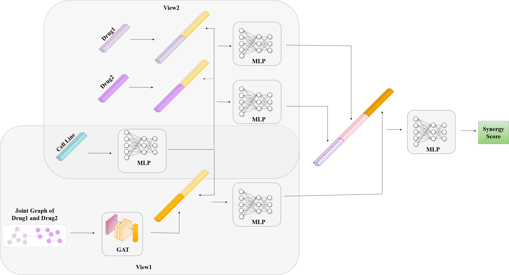
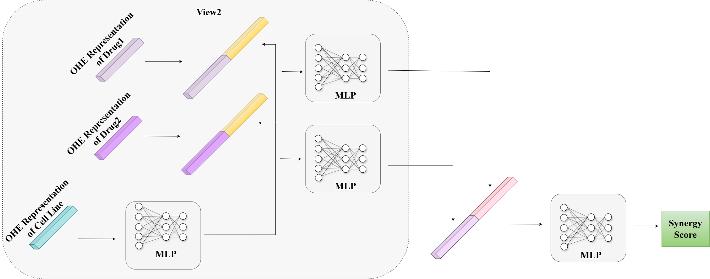

# JointSyn: Dual-view jointly learning improves personalized drug synergy prediction

**JointSyn** is a recent multi-modal deep learning model that integrates various drug and cell line representations to predict drug synergy. The model employs a dual-view architecture, where drug combinations and cell lines are embedded separately before being passed to a prediction network.

- **Drug Features**: Molecular graphs, where atoms are nodes and bonds are edges.  
- **Cell Line Features**: Cell line gene expression profiles.
- **Drug Representations:**
  - **Molecular Graphs:** Nodes represent atoms, edges represent bonds, and each atom has a 78-dimensional atomic feature vector.
  - **Morgan Fingerprints:** Extended-connectivity fingerprints (ECFP6) with 1,309 features.
- **Cell Line Representation:** Cell line gene expression profiles.

---

## JointSyn Architecture

The architecture of the JointSyn model is shown below:

  

*Figure 1: Architecture of JointSyn, inspired by Li et al. (2024)*

---

## Dataset and Splitting Information

JointSyn was trained on a **subset of the O’Neil dataset**, as detailed in its original publication. The dataset consists of:

- **12,033 drug combinations**
- **38 drugs**
- **34 cell lines**

For training, **Leave-Triple-Out (LTO) splitting** was applied, following the methodology provided by the authors. Each fold was repeated across **10 different replicates**, ensuring robustness in the evaluation.

---

In one-hot encoded feature experiments, the graph-based components of the original architecture were removed. One-hot encoded features were directly provided as input, as shown in **Figure 2**:

  

*Figure 2: Architecture of JointSyn for training with one hot encoded features*

---

### O'Neil Dataset

#### Combination Dataset
- **`data_to_split.csv`**:  Available under the `rawData/` folder. Contains drug pair and cell line combination information with synergy Loewe scores.
Assign to variable: `data`
  
#### Drug & Cell Line Features
- **Drug Features**:
  - Download [Drug_use.csv](https://huggingface.co/datasets/ebcandir/JointSyn/resolve/main/jointsyn_data/Drug_use.csv)
    Assign to variable: `drug_fp` 
- **Cell Line Features**:
  - Download [Cell_use.csv](https://huggingface.co/datasets/ebcandir/JointSyn/resolve/main/jointsyn_data/Cell_use.csv)
  Assign to variable: `cell`
- **Pair Graph**:
  - Download [Pair_graph.npy](https://huggingface.co/datasets/ebcandir/JointSyn/resolve/main/jointsyn_data/Pair_graph.npy)
  Assign to variable: `pair_graph` 

#### One-Hot Encoded Features
- **Drug Features**:
- `ohe_drug.csv`: Available under the `rawData/` folder. One-hot encoded representation for drugs.
Assign to variable: `drug_fp`
- **Cell Line Features**:
- `ohe_cell.csv`: Available under the `rawData/` folder. One-hot encoded representation for cell lines.
Assign to variable: `cell`

#### Shuffled Features
- **Drug Features**:
  - Download [Drug_use_shuffled.csv](https://huggingface.co/datasets/ebcandir/JointSyn/resolve/main/shuffled_data/Drug_use_shuffled.csv) 
  Assign to variable: `drug_fp` 
- **Cell Line Features**:
  - Download [Cell_use_shuffled.csv](https://huggingface.co/datasets/ebcandir/JointSyn/resolve/main/shuffled_data/Cell_use_shuffled.csv) 
  Assign to variable: `cell`
- **Pair Graph**:
  - Download [Pair_graph_shuffled.npy](https://huggingface.co/datasets/ebcandir/JointSyn/resolve/main/shuffled_data/Pair_graph_shuffled.npy)
  Assign to variable: `pair_graph` 
---
#### Splited Data 

This [folder](https://huggingface.co/datasets/ebcandir/JointSyn/tree/main/split_data) contains pre-split training, validation, and test datasets.
You can download and directly use these files to train models.

### Training JointSyn with Drug & Cell Line Features and Shuffled Features

```bash
python main.py
```
For Drug & Cell Line Features, use their corresponding files.
For Shuffled Features, use the shuffled versions of the files.

### Training JointSyn with One-Hot Encoded Features

```bash
python main_ohe.py
```


## Reproducing Experiments
> JointSyn uses graph libraries that conflict with packages in other models.
Please create and use a separate conda environment for JointSyn.

```bash
conda env create -f JointSyn/environment.yml
conda activate jointSyn
```

For further details on the JointSyn framework, original dataset or dataset preparation, visit the official JointSyn [GitHub repository](https://github.com/LiHongCSBLab/JointSyn)

> **Important Note:** Ensure you provide the correct paths to the input files and directories.
