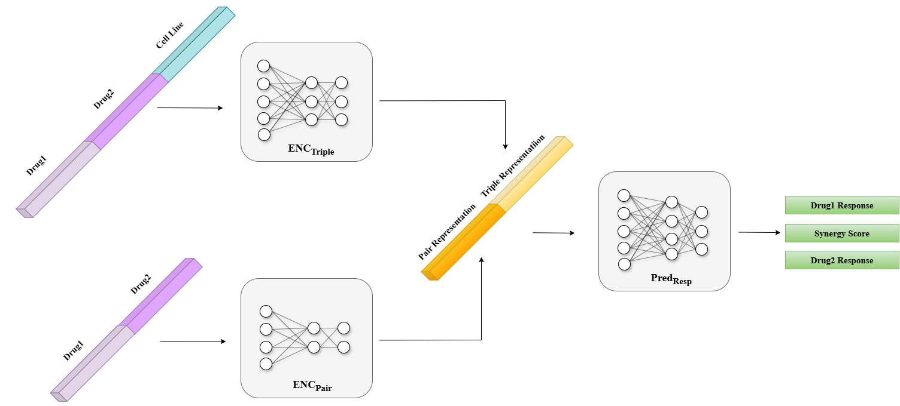

# MARSY: A Multitask Deep Learning Framework for Drug Combination Synergy Prediction

**MARSY** is a multitask deep learning-based model designed to predict **ZIP synergy scores** for drug combinations and single drug responses for individual drugs.  

- **Drug Features**: Gene expression signatures measured after treating **MCF7** and **PC3** cell lines with drugs.  
- **Cell Line Features**: Cell line gene expression profiles.

---

## MARSY Architecture

The architecture of the MARSY model is shown below:

  

*Figure 1: Architecture of MARSY, inspired by El Khili et al. (2023)*

---

## Dataset and Splitting Information

MARSY was trained on the **DrugComb** dataset using **Leave-Pair-Out (LPO)** splits and 5-fold cross-validation. The dataset, splits, and hyperparameters were provided by the authors.

Split files are located in:  
> - `data/lpo_folds`

---

### DrugComb Dataset

#### Combination Dataset
- **`data.csv`**: Available under the `data/` folder. Contains drug pair and cell line combination information with synergy scores.

#### Drug & Cell Line Features
- **Drug Features**:
  - `PC3_drugs_gene_expression.csv`: Gene expression profiles for drugs treated on the PC3 cell line (vector length: 978).
  - `MCF7_drugs_gene_expression.csv`: Gene expression profiles for drugs treated on the MCF7 cell line (vector length: 978).
  - To prepare drug features, concatenate `Drug1_PC3`, `Drug1_MCF7`, `Drug2_PC3`, and `Drug2_MCF7` for each drug pair.

- **Cell Line Features**:
  - `75_cell_lines_gene_expression.csv`: Gene expression profiles for 75 cell lines, each with 4639 genes.

- **Final Feature Vector**:
  After concatenating all features, the final vector length for each instance is:  
  `978 (Drug1_PC3) + 978 (Drug1_MCF7) + 978 (Drug2_PC3) + 978 (Drug2_MCF7) + 4639 (Cell Line) = 8551`.

  
#### One-Hot Encoded Features
- **`ohe_dataset.csv`**: Contains one-hot encoded representations for both drugs and cell lines.

> Note: You can generate `ohe_dataset.csv` using the provided `generate_ohe_data.py` script or download it directly [here](https://drive.google.com/file/d/1vElNqjcgs2Fic9lfCLAdXNchziUGQzuc/view?usp=sharing).


---
### Training MARSY with Drug & Cell Line Features

```bash
python MARSY.py
```

### Training MARSY with One-Hot Encoded Features

```bash
python MARSY_ohe.py
```


## Reproducing Experiments

For further details on the MARSY framework or dataset preparation, visit the official MARSY [GitHub repository](https://github.com/Emad-COMBINE-lab/MARSY/tree/main/data)

> **Important Note:** Ensure you provide the correct paths to the input files and directories.
