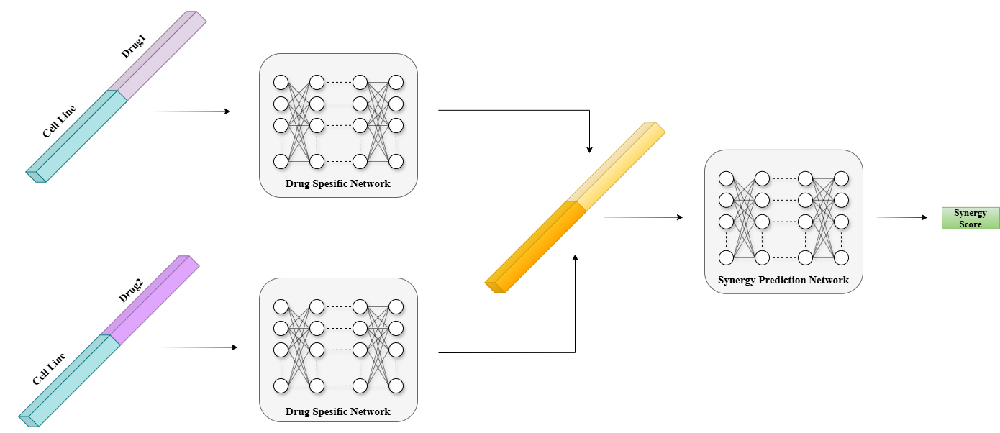

# MatchMaker: Deep Neural Network for Drug Synergy Prediction

**MatchMaker** is a deep learning-based drug synergy prediction algorithm that predicts the Loewe score of drug pairs. The model utilizes:

- **Drug Features**: Chemical descriptors.
- **Cell Line Features**: Cell line gene expression profiles.

---

## MatchMaker Architecture

The MatchMaker architecture is shown in figure below.




*Figure 1: Architecture of Matchmaker, inspired by Kuru et al. (2022)*

---

## Dataset and Splitting Information

We trained MatchMaker using its **default parameters** on updated datasets:

- **DrugComb**
- **NCI Almanac**

Splits used for both datasets:
- **Leave-Pair-Out (LPO)**  
- **Leave-CellLine-Out (LCO)**
- **Leave-One-Drug-Out (LODO)**  
- **Leave-Drug-Out (LDO)**  

Each split strategy was repeated across 10 different random replicates, ensuring robustness in the evaluation. Results were averaged across these replicates.

---
Split files are located in:
> - `DrugComb/splits`
> - `NCI_ALMANAC/splits`


---

### DrugComb Dataset

Combination Dataset:  
- `DrugComb.csv` (available under `DrugComb/` folder)

#### Features for Training
1. **Drug & Cell Line Features**  
   Download: [DrugComb Features](https://drive.google.com/file/d/14ipmuRyC4lLcE0MVZM7m3WbJuJU6fBwl/view?usp=sharing)  

   - Drugs:  
     - `drug1_chem_desc.csv`  
     - `drug2_chem_desc.csv`  
   - Cell Line:  
     - `cell_line_gex.csv`  

2. **One-Hot Encoded Features**  
   Download: [One-Hot Features](https://drive.google.com/file/d/1d1tCUPDNsCs9IiIKGTOkp-BFso1__-Hy/view?usp=sharing)  
   - Drugs:  
     - `drug1_ohe.csv`  
     - `drug2_ohe.csv`  
   - Cell Line:  
     - `cell_line_ohe.csv`  

---

### NCI Almanac Dataset

Combination Dataset:  
- `NCI_Almanac_Combo.csv` (available under `NCI_ALMANAC/` folder)

#### Features for Training
1. **Drug & Cell Line Features**  
   Download: [NCI Almanac Features](https://drive.google.com/file/d/1-4dnjBUln11B5ySqOwPQGJC4cAAOuuvy/view?usp=sharing)  
   - Drugs:  
     - `drug1_chem_desc.csv`  
     - `drug2_chem_desc.csv`  
   - Cell Line:  
     - `cell_gene_gex.csv`  

2. **One-Hot Encoded Features**  
   Download: [One-Hot Features](https://drive.google.com/file/d/1Gx-DiHw-ItbEPdUURkoFxsj8Cuf_Pnqo/view?usp=sharing)  
   - Drugs:  
     - `drug1_ohe.csv`  
     - `drug2_ohe.csv`  
   - Cell Line:  
     - `cell_line_ohe.csv`  

---

## Training Examples 

### Example: DrugComb with One-Hot Encoded Features (LPO Split, Replicate 1)

```bash
export TF_DETERMINISTIC_OPS=1
python main.py \
    --comb-data-path drugcomb_data/DrugComb.csv \
    --cell-line-features-path drugcomb_data/cell_line_ohe.csv \
    --drug1-features-path drugcomb_data/drug1_ohe.csv \
    --drug2-features-path drugcomb_data/drug2_ohe_desc.csv \
    --train-test-mode 1 \
    --train-ind drugcomb_data/splits/lpo/train_set_lpo \
    --val-ind drugcomb_data/splits/lpo/val_set_lpo \
    --test-ind drugcomb_data/splits/lpo/test_set_lpo \
    --model-name drugcomb_data/lpo_matchmaker_saved_ohe \
    --output-path drugcomb_data/lpo/ \
    --drug-features 1 \
    --cell-line-features 1 \
    --split_index 1
```

### Example: DrugComb with Drug&Cell Line Features (LPO Split, Replicate 1)

```bash
export TF_DETERMINISTIC_OPS=1
python main.py \
    --comb-data-path drugcomb_data/DrugComb.csv \
    --cell-line-features-path drugcomb_data/cell_line_gex.csv \
    --drug1-features-path drugcomb_data/drug1_chem_desc.csv \
    --drug2-features-path drugcomb_data/drug2_chem_desc.csv \
    --train-test-mode 1 \
    --train-ind drugcomb_data/splits/lpo/train_set_lpo \
    --val-ind drugcomb_data/splits/lpo/val_set_lpo \
    --test-ind drugcomb_data/splits/lpo/test_set_lpo \
    --model-name drugcomb_data/lpo_matchmaker_saved \
    --output-path drugcomb_data/lpo/ \
    --drug-features 0 \
    --cell-line-features 0 \
    --split_index 1
```
### Example: NCI Almanac with One-Hot Encoded Features (LCO Split, Replicate 10)

```bash
export TF_DETERMINISTIC_OPS=1
python main.py \
    --comb-data-path NCI_ALMANAC/NCI_Almanac_Combo.csv \
    --cell-line-features-path NCI_ALMANAC/cell_line_ohe.csv \
    --drug1-features-path NCI_ALMANAC/drug1_ohe.csv \
    --drug2-features-path NCI_ALMANAC/drug2_ohe.csv \
    --train-test-mode 1 \
    --train-ind NCI_ALMANAC/splits/lco/train_set_lco_nci \
    --val-ind NCI_ALMANAC/splits/lco/val_set_lco_nci \
    --test-ind NCI_ALMANAC/splits/lco/test_set_lco_nci \
    --model-name NCI_ALMANAC/lco_matchmaker_saved_ohe \
    --output-path NCI_ALMANAC/lco/ \
    --drug-features 1 \
    --cell-line-features 1 \
    --split_index 10
```

## Reproducing Experiments

You can reproduce all experiments for both datasets across all splits using the provided examples. 

> **Important Note:** Ensure you provide the correct paths to the input files and directories.
