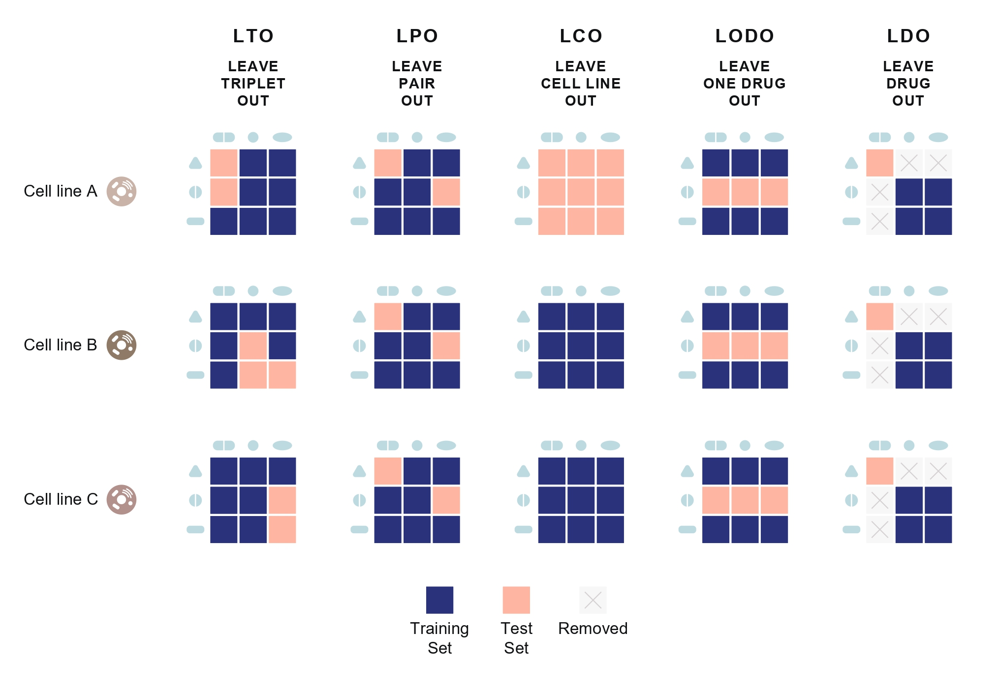
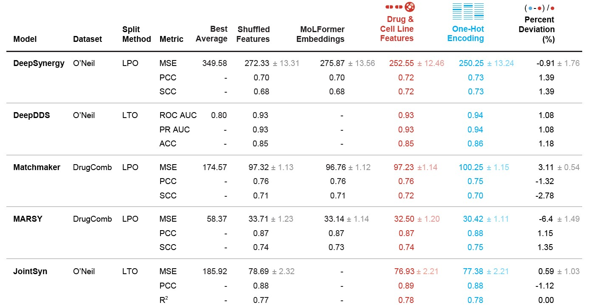

## **One-Hot News: Drug Synergy Models Take a Shortcut**
## Overview
This repository contains the code and data supporting our study, "One-Hot News: Drug Synergy Models Take a Shortcut". Our work reveals that drug synergy prediction models, instead of leveraging meaningful chemical or biological features, often learn shortcuts based on co-variation patterns in the dataset. By replacing rich molecular representations with simple one-hot encoded identifiers, we demonstrate that models can achieve comparable or even slightly improved performance—highlighting fundamental generalization issues in current deep learning approaches for drug synergy prediction.

---

### Splitting Methods
- **Leave-Triple-Out (LTO):** Random split.
- **Leave-Pair-Out (LPO):** Drug pairs do not appear in training, but individual drugs may.
- **Leave-CellLine-Out (LCO):** Cell lines do not appear in training.
- **Leave-One-Drug-Out (LODO):** One drug in the pair is never seen in training.
- **Leave-Drug-Out (LDO):** Neither drug in the pair appears in training.

*Figure 1: Illustration of data split strategies, inspired by Preuer et al. (2017).*

---

## Results

---

### Comparison of Synergy Prediction Models 

To compare their ability to capture information from drug and cell line features that affect their synergy scores, we evaluated the following models:

- **DeepSynergy**
- **DeepDDS**
- **MatchMaker**
- **MARSY**
- **JointSyn**

#### Approach
1. Reproduced each model using their **original hyperparameters**, **datasets**, and **splitting methods**.
2. Replaced original features with **one-hot-encoded features** to test their learning performance.


*Figure 2: Comparison of Drug \& Cell Line Features vs OHE Representations Across Different Models and Datasets.*

---

### Setting Up the Environment
To ensure reproducibility, install dependencies using Conda:
```
conda env create -f environment.yml
conda activate drug-synergy
```

---
We performed all experiments on systems equipped with Tesla V100-PCIE-32GB and Tesla V100S-PCIE-32GB GPUs.

---


## Training Instructions

Detailed instructions for training and reproducing the experiments are available in each model's respective folder. Follow the steps provided in the corresponding directories to set up and execute the models.
